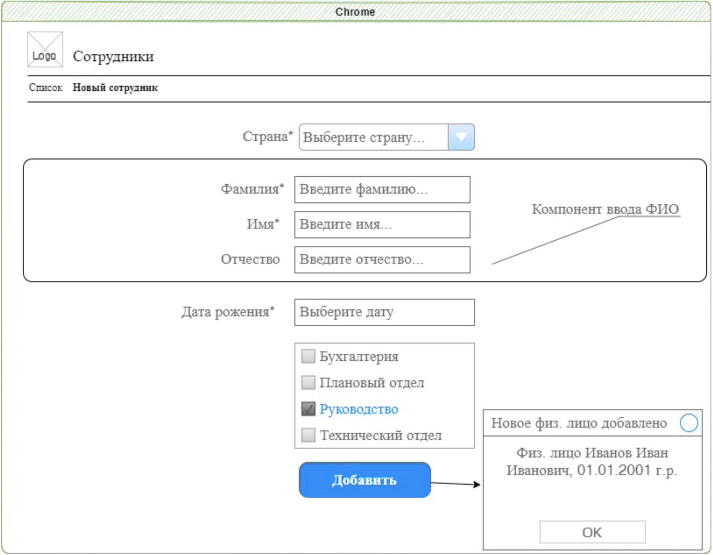

# Тестовое задание.

## Термины и определения.

Работодатель

Испытуемый 

## Общие положения.

Настоящее задание составлено с целью определить уровень владения технологиями FE-разработки “Испытуемого”. Соглашаясь на выполнение заданий настоящего документа “Испытуемый” принимает, что:

1. Все задания в настоящем документе носят некоммерческий характер. 
2. Результаты выполнения заданий не будут использованы работодателем для осуществления коммерческой деятельности и служат лишь для оценки соответствия навыков и знаний испытуемого требованиям к рабочему месту/должности в штатном расписании работодателя.
3. Успешное выполнение задания не обязывает Работодателя, принять на работу Испытуемого
4. Результаты выполнения заданий принадлежат в равной мере испытуемому и работодателю.
5. Выполнение работы испытуемым в рамках выполнения им заданий настоящего документа, в том числе результаты работ не подлежат оплате работодателем.

Стороны соглашаются что результаты выполнения заданий не содержат “ноу-хау”, изобретений либо новых вариантов использования и не являются предметом интеллектуальной собственности Сторон.

В случаях когда для выполнения заданий “Испытуемый” применяет технические средства, программное обеспечение либо иные средства являющейся собственностью третьих лиц, в том числе когда программное обеспечение принадлежащее третьей стороне предоставляется в составе результата выполнения заданий - “Испытуемый” полностью несет ответственность за их неправомерное использование.

## Назначение.

Задание предназначено для оценки уровня знаний и навыков Испытуемого технологий:

1. React([https://reactjs.org](https://reactjs.org))
2. Typescript([https://www.typescriptlang.org](https://www.typescriptlang.org))
3. AntDesign([https://ant.design](https://ant.design))
4. StoryBook([https://storybook.js.org](https://storybook.js.org))
5. Навыков программирования.
6. Навыков адаптивной верстки.

## Задание.

Цель задания - разработать одностраничное приложение(П) с формой ввода данных сотрудника, применяя элемент (компонент) собственной разработки для отображения и редактирования данных ФИО(Элемент ввода ФИО).

Приложение должно реализовывать следующее поведение:

1. На главной(и единственной) странице приложения пользователь выбирает из выпадающего списка(С) Страну(Россия, США, Урупляндия)  (json-файл со списком стран с кодами)
2. Вводит в элемент ввода ФИО (Э), отдельно для каждого атрибута: Фамилию(Ф), Имя(И), Отчество(О)
    1. При выборе(С) Россия:
        1. Отображаются и доступны для редактирования три поля ввода: Ф,И,О
        2. Ввод в поля ограничен только кириллицей
        3. При вводе имени автоматически отображаются подсказки для имен “Александр, Алексей, Полина,Дарья” (json-файл с именами для разных стран)
    2. При выборе(С) США:
        1. Отображаются и доступны для редактирования два(из трех) полей ввода: Ф,И
        2. Ввод в поля ограничен латиницей
        3. При вводе имени автоматически отображаются подсказки для имен: “Alexander, Alvin, George” (json-файл с именами для разных стран)
    3. При выборе(С) Урупляндия
        1. Отображаются и доступны для редактирования три поля ввода: Ф,И,О
        2. Ввод в поля ограничен:
            1. Для Ф - латиницей
            2. Для О - кириллицей
            3. Для И - латиницей и кириллицей
        3. При вводе имени автоматически отображаются подсказки.  (json-файл с именами для разных стран)
3. Остальные элементы приложения - логика в соответствии с макетом экрана.

## Требование к результату.

1. Приложение(П), должно быть реализовано с применением техник адаптивной верстки. 
2. Весь функционал элемента (Э) ввода ФИО описанный в задании должен быть реализован в одном элементе управления. Элемент ввода должен быть разработан на базе фреймворка AntDesign.
3. Элемент ввода ФИО(Э) должен быть протестирован и иметь не менее 4-х вариантов тестов в StoryBook
4. Элемент ввода ФИО(Э) должен подключаться в приложение отдельным npm-пакетом. NPM-пакет с элементом ввода ФИО должен быть документирован - описана установка и использование.
5. Реализация элемента ввода ФИО(Э) должна быть выполнена без прямого кодирования функциональных характеристик и данных из условий задания.(Без хардкодинга)
6. В качестве базового фреймворка для разработки элемента ввода ФИО(Э) необходимо использовать AntDesign
7. Исходный код - TypeScript
8. Все элементы управления кроме Элемента ввода ФИО(Э) - стандартные компоненты AntDesign.

Результат выполнения задания направляется Работодателю посредством электронной почты, по адресу [support@avmdata.ru](mailto:support@avmdata.ru) с оценкой затраченного времени.

## Требования к процессу разработки.

1. Разработка производится Испытуемым на оборудовании и с применением программного обеспечения принадлежащем Испытуемому либо имеющем право на использование Испытуемым.
2. Проекты с исходным кодом публикуются Испытуемым в публичном репозитории GitHub в момент начала работы над заданием. Доступ к проекту с кодом репозитория предоставляется Работодателю, для адреса [support@avmdata.ru](mailto:support@avmdata.ru).
3. Испытуемый в процессе выполнения задания ежедневно выполняет запись изменений в репозиторий проекта.
4. В процессе выполнения задания Испытуемым ведется ежедневная оценка и запись затраченного времени.

Приложение.

**Пример json-файла имен **

[

  {

    "name": "Александр"

    "country": "RU"

  },

  {

    "name": "Александра"

    "country": "RU"

  },

  {

    "name": "George"

    "country": "US"

  }

]

**Пример json-файла списка стран**

[

  {

    "name": "Россия (Russia)",

    "code": "RU"

  },

  {

    "name": "Соединенные штаты (USA)",

    "code": "US"

  }

]
